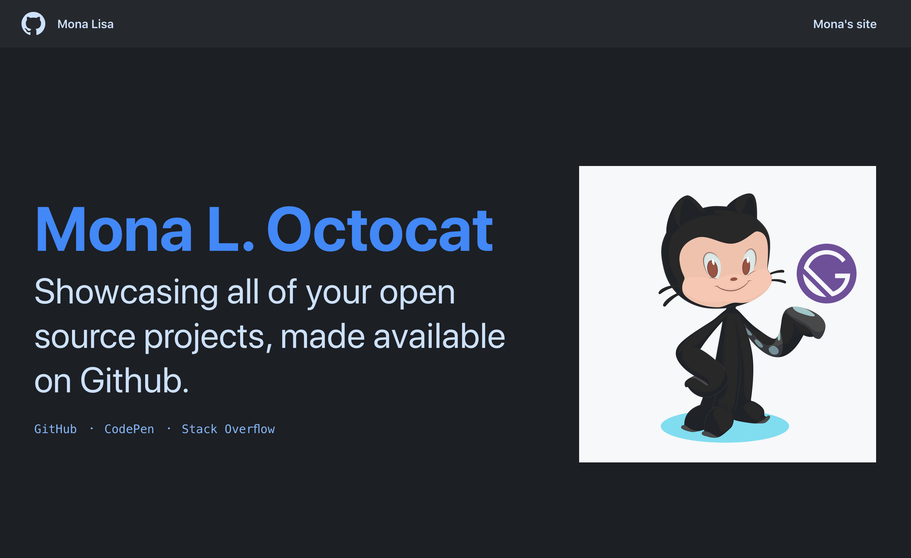

<!-- AUTO-GENERATED-CONTENT:START (STARTER) -->
<p align="center">
  <a href="https://www.gatsbyjs.org">
    
  </a>
</p>
<h1 align="center">
  Gatsby Primer Starter
</h1>

⚠️ The props used in this starter are outdated. There may be breaking CSS changes. Please refer to [primer.style/components](https://primer.style/components) for the latest conventions.

Want a space to showcase your open source projects? Use this Gatsby starter, made with Github's Design System, **[Primer](https://github.com/primer)**.



## 🚀 Quick start

1.  **Create a Gatsby site.**

    Use the Gatsby CLI to create a new site, specifying the default starter.

    ```sh
    # create a new Gatsby site using the default starter
    gatsby new my-primer-starter https://github.com/thomaswang/gatsby-starter-primer
    ```

1.  **Start developing.**

    Navigate into your new site’s directory and start it up.

    ```sh
    cd my-primer-starter/
    gatsby develop
    ```

1.  **Open the source code and start editing!**

    Your site is now running at `http://localhost:8000`!

    _Note: You'll also see a second link: _`http://localhost:8000/___graphql`_. This is a tool you can use to experiment with querying your data. Learn more about using this tool in the [Gatsby tutorial](https://www.gatsbyjs.org/tutorial/part-five/#introducing-graphiql)._

    Open the `my-primer-starter` directory in your code editor of choice and edit `src/pages/index.js`. Save your changes and the browser will update in real time!

## 🔔 Important files

Remember to edit these files to customize the basic template:

- **`gatsby-config.js`**: This is the main configuration file for a Gatsby site. This is where you can specify information about your site (metadata) like the site title and description, which Gatsby plugins you’d like to include, etc. (Check out the [config docs](https://www.gatsbyjs.org/docs/gatsby-config/) for more detail).

- **`src/components/nav.js`**: This is your header component. Edit the name and website link!

- **`src/pages/index.js`**: This is your index page that loads at `/`. Customize it to make it your own.

## 🎓 Learning Gatsby

Looking for more guidance? Full documentation for Gatsby lives [on the website](https://www.gatsbyjs.org/). Here are some places to start:

- **For most developers, we recommend starting with our [in-depth tutorial for creating a site with Gatsby](https://www.gatsbyjs.org/tutorial/).** It starts with zero assumptions about your level of ability and walks through every step of the process.

- **To dive straight into code samples, head [to our documentation](https://www.gatsbyjs.org/docs/).** In particular, check out the _Guides_, _API Reference_, and _Advanced Tutorials_ sections in the sidebar.

## 🔷 Using Primer

The design of the page is based on the [Primer website](https://github.com/primer/primer.style) and uses [Primer React component library](https://primer.style/components). Primer is open-source and and maintained by GitHub’s [Design Systems team](https://primer.style/team).

Take a look at their [documentation](https://styleguide.github.com/primer/) and see what you can make!

## 💫 Deploy

[](https://app.netlify.com/start/deploy?repository=https://github.com/thomaswangio/gatsby-starter-primer)
